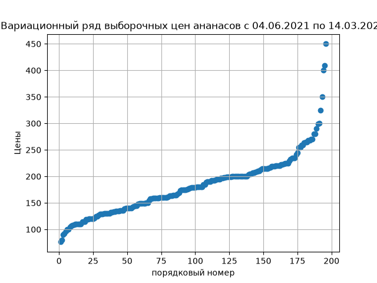
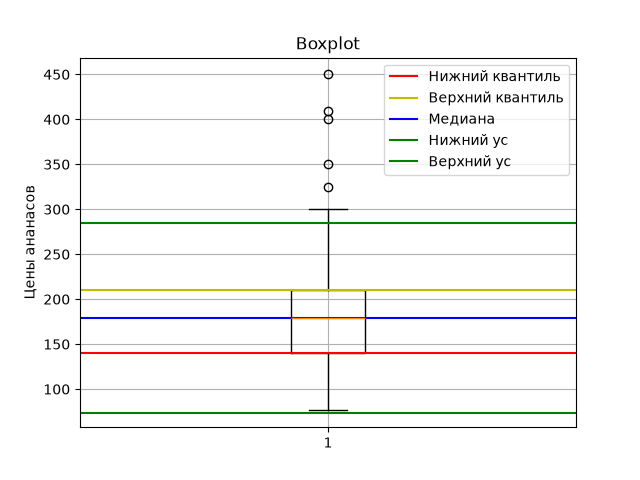
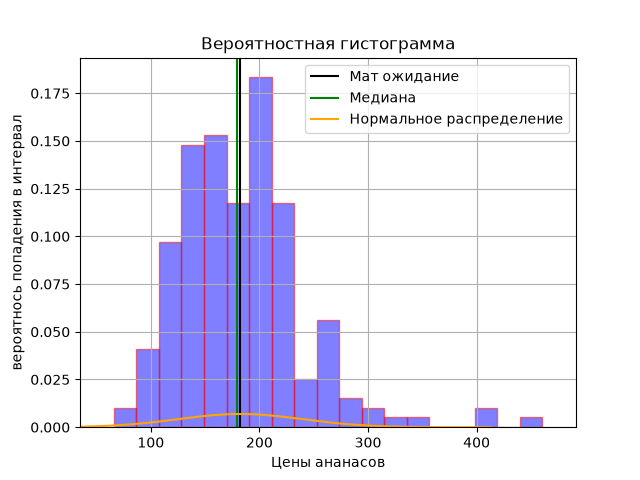
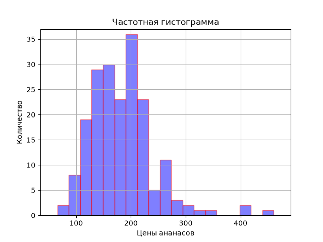
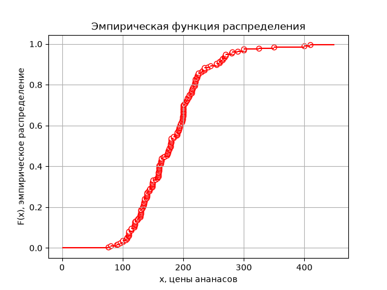

# Отчёт по анализу выборочных цен ананасов (2021–2025)
Автор: Карасёва Яна

Период данных: 04.06.2021 — 14.03.2025

### Цель: Анализ выборочных цен ананасов в Москве и исследование распределения данных.

## Анализ данных
* Объём выборки: 196
* Уникальных значений: 191
* Минимум: 148.165
* Максимум: 484.25
* Среднее арифметическое: 273.62
* Среднее взвешенное: 273.62
* Дисперсия: 3921.61
* Стандартное отклонение: 62.46
* Медиана: 273.36
* Мода: 220.6
* Первый квартиль Q1: 231.37
* Второй квартиль Q2: 273.36
* Третий квартиль Q3: 311.20
* Межквартильный диапазон (IQR): 79.83
* Размах выборки: 336.09
* Шаг интервала: 18.67

## Выводы по графикам
1. Вариационный ряд
    
    Цена сначала скачет, затем растет более равномерно. Начиная со стоимости в ~350 рублей наблюдается резкий подъём. Видны 4 выброса.

2. Boxplot

    Выбросы отчётливо видны.
    Медиана расположена близко к центру коробки -> распределение близко к симметричному.

3. Гистограммы

    Частотная и вероятностная гистограммы подтверждают наличие выбросов.

4. Сравнение с нормальным распределением

    Медиана и мат ожидание почти совпадают, что еще раз говорит о симметричном распределении данных. Однако нормальное распределение не покрывает гистограмму, значит данные не являются нормальными.

5. Эмпирическая функция распределения

    Показывает равномерный рост вероятности, но с небольшими скачками из‑за выбросов.

## Использованные методы
* описательная статистика;
* квартильный анализ;
* выявление выбросов (IQR);
* вариационный ряд;
* частотная и вероятностная гистограммы;
* сравнение с нормальным распределением;
* ECDF (эмпирическая функция распределения).

## Использованные библиотеки
* NumPy
* Pandas
* Matplotlib
* SciPy
* statistics